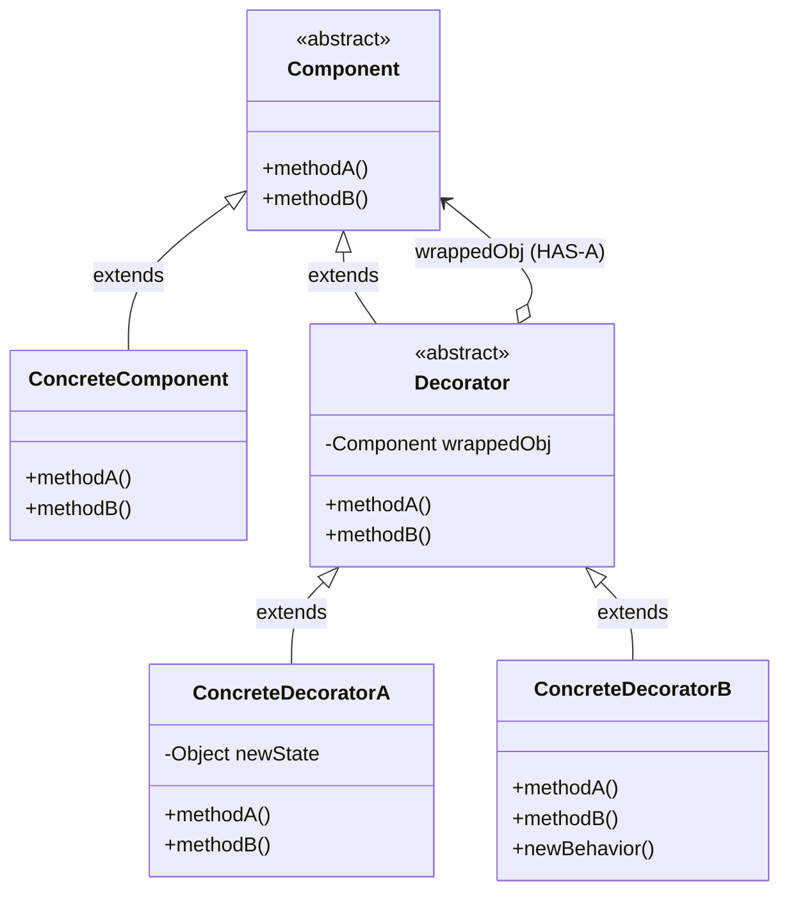
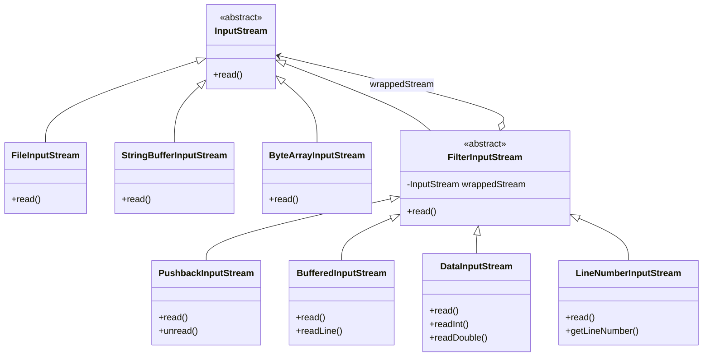

# The Decorator Pattern

## CENG431 – Software Engineering | Week 4 Lecture Notes

**Ankara Yıldırım Beyazıt University – Department of Computer Engineering**

---

## 1. Introduction

The Decorator Pattern addresses a fundamental question in object-oriented design: how do you add new responsibilities to objects without modifying their existing code? While inheritance is a powerful tool, it is not always the best way to achieve flexibility. The Decorator Pattern offers an elegant alternative by using **composition** and **delegation** to extend behavior at runtime.

> **The Decorator Pattern** attaches additional responsibilities to an object dynamically. Decorators provide a flexible alternative to subclassing for extending functionality.

The core insight is that instead of creating a subclass for every possible combination of features, you create small wrapper objects (decorators) that add one feature each and can be stacked in any combination.

---

## 2. Motivation: The Starbuzz Coffee Problem

### 2.1 The Initial Design

Starbuzz Coffee needs an ordering system for their beverages. Their initial design uses a simple inheritance hierarchy:

```java
public abstract class Beverage {
    String description = "Unknown Beverage";

    public String getDescription() {
        return description;
    }

    public abstract double cost();
}
```

Each beverage type extends `Beverage` and implements `cost()`:

```java
public class HouseBlend extends Beverage {
    public HouseBlend() { description = "House Blend Coffee"; }
    public double cost() { return 0.89; }
}

public class DarkRoast extends Beverage {
    public DarkRoast() { description = "Most Excellent Dark Roast"; }
    public double cost() { return 0.99; }
}

public class Espresso extends Beverage {
    public Espresso() { description = "Espresso"; }
    public double cost() { return 1.99; }
}

public class Decaf extends Beverage {
    public Decaf() { description = "Decaf Coffee"; }
    public double cost() { return 1.05; }
}
```

This works fine when you only have four beverages and no customization.

### 2.2 The Condiment Problem

But customers want to add condiments: steamed milk, soy, mocha (chocolate), and whipped cream. Each condiment has its own price. If we try to handle every combination through subclassing, we get a **class explosion**:

- `HouseBlendWithSteamedMilk`
- `HouseBlendWithMocha`
- `HouseBlendWithSteamedMilkAndMocha`
- `HouseBlendWithSoyAndMochaAndWhip`
- `DarkRoastWithSteamedMilk`
- `DarkRoastWithMocha`
- ... and so on for every possible combination

With 4 beverages and 4 condiments (each can be present or absent), we'd need dozens of classes. Adding a new condiment or beverage multiplies the problem further. This is clearly unmaintainable.

### 2.3 The Instance Variable Approach (Still Wrong)

A second attempt puts boolean flags for each condiment into the `Beverage` superclass:

```java
public abstract class Beverage {
    String description;
    boolean milk, soy, mocha, whip;

    public double cost() {
        double condimentCost = 0.0;
        if (hasMilk()) condimentCost += 0.10;
        if (hasSoy()) condimentCost += 0.15;
        if (hasMocha()) condimentCost += 0.20;
        if (hasWhip()) condimentCost += 0.10;
        return condimentCost;
    }

    // getters and setters for each condiment...
}

public class DarkRoast extends Beverage {
    public DarkRoast() {
        description = "Most Excellent Dark Roast";
    }

    public double cost() {
        return 0.99 + super.cost(); // adds condiment costs
    }
}
```

This reduces the number of classes, but creates new problems:

**Problem 1: Price changes require modifying existing code.** When the price of soy goes up, you must change the `Beverage` class.

**Problem 2: New condiments require modifying the superclass.** Adding caramel means adding a new boolean, new getters/setters, and modifying `cost()`.

**Problem 3: Inappropriate inheritance.** A `Tea` subclass would inherit `hasWhip()` even though whip might not be appropriate for tea.

**Problem 4: No support for multiples.** What if a customer wants a double mocha? A boolean only tracks presence, not quantity.

**Design principles violated:**
- **Open/Closed Principle** — classes are not closed for modification.
- **Encapsulate what varies** — the condiment logic is not encapsulated.

---

## 3. The Open-Closed Principle

Before introducing the pattern, we need an important design principle:

> **Design Principle:** Classes should be open for extension, but closed for modification.

This means our goal is to design systems where we can add new behavior **without changing existing code**. This gives us designs that are resilient to change and flexible enough to handle new requirements.

The key insight from the "Master and Student" dialogue in the book:

- **Inheritance** sets behavior statically at compile time. All subclasses must inherit the same behavior.
- **Composition** allows extending behavior dynamically at runtime by composing objects together.
- By dynamically composing objects, we can add new functionality by writing **new code** rather than **altering existing code**, greatly reducing the risk of introducing bugs.

Important caveat: applying the Open-Closed Principle everywhere is wasteful and can lead to unnecessarily complex code. Be strategic about which areas of your code need to be extensible.

---

## 4. Understanding the Decorator Pattern

### 4.1 The Core Idea: Wrapping

Instead of relying on inheritance to add features, we "wrap" objects with decorator objects. Each decorator adds one responsibility. Decorators can be stacked in any combination and quantity.

Think of it like Russian nesting dolls (matryoshka): each outer layer adds something, but the core object remains unchanged.

### 4.2 Constructing a Drink Order Step by Step

Let's say a customer orders a **Dark Roast with Mocha and Whip**:

**Step 1:** Start with a `DarkRoast` object. It has a `cost()` method that returns $0.99.

**Step 2:** Wrap it with a `Mocha` decorator. The Mocha object holds a reference to the DarkRoast. Since Mocha is also a Beverage (same supertype), it has its own `cost()` method.

**Step 3:** Wrap the Mocha with a `Whip` decorator. Whip holds a reference to the Mocha (which holds a reference to DarkRoast). Again, Whip is also a Beverage with its own `cost()`.

**Step 4:** Call `cost()` on the outermost decorator (Whip). The computation chains through delegation:

```
Whip.cost()
  → calls Mocha.cost()
      → calls DarkRoast.cost()
      ← returns $0.99
    ← adds $0.20 (Mocha), returns $1.19
  ← adds $0.10 (Whip), returns $1.29

Final cost: $1.29
```

The beauty is that `DarkRoast` was never modified. The condiment costs were added dynamically through wrapping.

### 4.3 Key Characteristics of Decorators

1. **Decorators have the same supertype as the objects they decorate.** This is essential for substitutability — a decorated object can be used anywhere the original object is expected.

2. **You can use one or more decorators to wrap an object.** There's no limit to the number of wrappers.

3. **The decorator adds its own behavior before and/or after delegating to the wrapped object.** This is how new responsibilities are attached.

4. **Objects can be decorated at any time.** Decoration happens dynamically at runtime, not statically at compile time.

5. **A decorated object is still the same type as the original.** Through polymorphism, clients don't need to know whether they're dealing with a plain or decorated object.

---

## 5. Formal Definition and Class Diagram

### 5.1 Pattern Definition

> **The Decorator Pattern** attaches additional responsibilities to an object dynamically. Decorators provide a flexible alternative to subclassing for extending functionality.

### 5.2 General Class Diagram




```
                    +----------------------------+
                    |  <<abstract>> Component     |
                    +----------------------------+
                    |  methodA()                  |
                    |  methodB()                  |
                    +-------------+--------------+
                          ^       ^
              extends     |       |     extends
                          |       |
        +-----------------+--+  +-+---------------------------+
        | ConcreteComponent  |  |   <<abstract>> Decorator     |
        +--------------------+  +------------------------------+
        | methodA()          |  | Component wrappedObj ------->* Component
        | methodB()          |  | methodA()                    |  (HAS-A)
        +--------------------+  | methodB()                    |
                                +----------+---+---------------+
                                           |   |
                                 extends   |   |  extends
                                           |   |
                            +--------------++  ++-----------------+
                            |ConcreteDecorA |  |ConcreteDecorB    |
                            +---------------+  +------------------+
                            | Object newState|  | methodA()       |
                            | methodA()      |  | methodB()       |
                            | methodB()      |  | newBehavior()   |
                            +----------------+  +-----------------+
```

**Relationships in the Diagram:**

| Relationship Type       | From → To                        | Meaning                                                               |
| ----------------------- | -------------------------------- | --------------------------------------------------------------------- |
| **extends (IS-A)**      | ConcreteComponent → Component    | The concrete component is a subtype of `Component`                    |
| **extends (IS-A)**      | Decorator → Component            | `Decorator` is also of type `Component` (polymorphism)                |
| **extends (IS-A)**      | ConcreteDecoratorA/B → Decorator | Concrete decorators derive from `Decorator`                           |
| **HAS-A (Composition)** | Decorator → Component            | `Decorator` holds a **reference** to a `Component` named `wrappedObj` |


### 5.3 Component Descriptions

**Component** — The abstract class (or interface) that defines the common type for both the concrete components and the decorators. This is what makes substitutability possible.

**ConcreteComponent** — The original object to which we want to add new behavior dynamically. It can be used on its own or wrapped by one or more decorators.

**Decorator** — An abstract class that extends (or implements) Component and holds a reference to a Component. It mirrors the Component's interface and delegates calls to the wrapped object.

**ConcreteDecorator** — Extends the Decorator. Adds its own state or behavior before and/or after delegating to the wrapped component. Each decorator adds one specific responsibility.

### 5.4 Inheritance vs. Composition in the Decorator Pattern

A subtle but crucial point: the Decorator Pattern uses inheritance **for type matching** (so a decorator IS-A Component), but it uses **composition for behavior** (the decorator HAS-A Component and delegates to it). This is fundamentally different from using inheritance to get behavior from a parent class.

| Aspect | Traditional Inheritance | Decorator Pattern |
|---|---|---|
| Type matching | Subclass IS-A superclass | Decorator IS-A Component (for substitutability) |
| Behavior extension | Inherited from parent at compile time | Delegated to wrapped object at runtime |
| Flexibility | Static, fixed at compile time | Dynamic, can be changed at runtime |
| Combining behaviors | Need a new subclass for each combination | Stack decorators in any combination |

---

## 6. Implementation: Starbuzz Coffee with Decorators

### 6.1 The Beverage Class (Component)

```java
public abstract class Beverage {
    String description = "Unknown Beverage";

    public String getDescription() {
        return description;
    }

    public abstract double cost();
}
```

`Beverage` serves as the abstract component. It defines the interface that both concrete beverages and decorators must follow: `getDescription()` and `cost()`.

### 6.2 The CondimentDecorator Class (Abstract Decorator)

```java
public abstract class CondimentDecorator extends Beverage {
    public abstract String getDescription();
}
```

`CondimentDecorator` extends `Beverage` to ensure type compatibility (a condiment IS-A Beverage). It requires all concrete decorators to re-implement `getDescription()` so that each condiment can append its name to the beverage description.

### 6.3 Concrete Beverages (Concrete Components)

```java
public class Espresso extends Beverage {
    public Espresso() {
        description = "Espresso";
    }

    public double cost() {
        return 1.99;
    }
}

public class HouseBlend extends Beverage {
    public HouseBlend() {
        description = "House Blend Coffee";
    }

    public double cost() {
        return 0.89;
    }
}

public class DarkRoast extends Beverage {
    public DarkRoast() {
        description = "Most Excellent Dark Roast";
    }

    public double cost() {
        return 0.99;
    }
}

public class Decaf extends Beverage {
    public Decaf() {
        description = "Decaf Coffee";
    }

    public double cost() {
        return 1.05;
    }
}
```

Each concrete beverage sets its description and returns its base price. These classes are simple and never need to be modified when new condiments are added.

### 6.4 Concrete Decorators (Condiments)

#### Mocha

```java
public class Mocha extends CondimentDecorator {
    Beverage beverage;

    public Mocha(Beverage beverage) {
        this.beverage = beverage;
    }

    public String getDescription() {
        return beverage.getDescription() + ", Mocha";
    }

    public double cost() {
        return 0.20 + beverage.cost();
    }
}
```

Key design points:

- `Mocha` holds a reference to a `Beverage` (the component it wraps).
- The constructor takes a `Beverage`, allowing us to wrap any beverage (or any already-decorated beverage).
- `getDescription()` delegates to the wrapped beverage and appends ", Mocha".
- `cost()` delegates to the wrapped beverage's `cost()` and adds Mocha's price ($0.20).

#### Soy

```java
public class Soy extends CondimentDecorator {
    Beverage beverage;

    public Soy(Beverage beverage) {
        this.beverage = beverage;
    }

    public String getDescription() {
        return beverage.getDescription() + ", Soy";
    }

    public double cost() {
        return 0.15 + beverage.cost();
    }
}
```

#### Whip

```java
public class Whip extends CondimentDecorator {
    Beverage beverage;

    public Whip(Beverage beverage) {
        this.beverage = beverage;
    }

    public String getDescription() {
        return beverage.getDescription() + ", Whip";
    }

    public double cost() {
        return 0.10 + beverage.cost();
    }
}
```

#### Milk

```java
public class Milk extends CondimentDecorator {
    Beverage beverage;

    public Milk(Beverage beverage) {
        this.beverage = beverage;
    }

    public String getDescription() {
        return beverage.getDescription() + ", Steamed Milk";
    }

    public double cost() {
        return 0.10 + beverage.cost();
    }
}
```

Notice how all condiment decorators follow the exact same structure. Each one is independent and focused on a single responsibility.

### 6.5 The Test Harness

```java
public class StarbuzzCoffee {
    public static void main(String[] args) {
        // Order 1: Espresso, no condiments
        Beverage beverage = new Espresso();
        System.out.println(beverage.getDescription()
            + " $" + beverage.cost());

        // Order 2: Dark Roast with double Mocha and Whip
        Beverage beverage2 = new DarkRoast();
        beverage2 = new Mocha(beverage2);    // wrap with Mocha
        beverage2 = new Mocha(beverage2);    // wrap with another Mocha
        beverage2 = new Whip(beverage2);     // wrap with Whip
        System.out.println(beverage2.getDescription()
            + " $" + beverage2.cost());

        // Order 3: House Blend with Soy, Mocha, and Whip
        Beverage beverage3 = new HouseBlend();
        beverage3 = new Soy(beverage3);
        beverage3 = new Mocha(beverage3);
        beverage3 = new Whip(beverage3);
        System.out.println(beverage3.getDescription()
            + " $" + beverage3.cost());
    }
}
```

### 6.6 Output

```
Espresso $1.99
Most Excellent Dark Roast, Mocha, Mocha, Whip $1.49
House Blend Coffee, Soy, Mocha, Whip $1.34
```

Notice how Order 2 has a **double Mocha** — something that was impossible with the boolean-flag approach. With decorators, you simply wrap it twice.

### 6.7 Tracing the Execution (Order 2)

Let's trace `beverage2.cost()` step by step:

```
beverage2 is: Whip → Mocha → Mocha → DarkRoast

Whip.cost()
  = 0.10 + Mocha.cost()
  = 0.10 + (0.20 + Mocha.cost())
  = 0.10 + (0.20 + (0.20 + DarkRoast.cost()))
  = 0.10 + (0.20 + (0.20 + 0.99))
  = 0.10 + (0.20 + 1.19)
  = 0.10 + 1.39
  = 1.49
```

And `beverage2.getDescription()`:

```
Whip.getDescription()
  = Mocha.getDescription() + ", Whip"
  = (Mocha.getDescription() + ", Mocha") + ", Whip"
  = ((DarkRoast.getDescription() + ", Mocha") + ", Mocha") + ", Whip"
  = (("Most Excellent Dark Roast" + ", Mocha") + ", Mocha") + ", Whip"
  = "Most Excellent Dark Roast, Mocha, Mocha, Whip"
```

---

## 7. Real-World Decorator: Java I/O

### 7.1 The I/O Class Hierarchy

The `java.io` package is designed around the Decorator Pattern. If you've ever felt overwhelmed by the number of classes in Java I/O, understanding decorators makes it all click.




```
ABSTRACT COMPONENT
    InputStream (abstract)
        |
        +-- extends -+-------------+------------------+-----------------+
        |             |              |                  |                 |
CONCRETE COMPONENTS                                ABSTRACT DECORATOR
    FileInputStream                                    FilterInputStream
    StringBufferInputStream                            (HAS-A: InputStream)
    ByteArrayInputStream                                   |
        (data sources)                                     +-- extends --+----------+-----------+
                                                           |             |          |           |
                                                    CONCRETE DECORATORS
                                                       Pushback       Buffered     Data     LineNumber
                                                       InputStream    InputStream  InputStream InputStream
```


Here is the translation into English, maintained in a technical and academic style suitable for computer science contexts:

Each concrete decorator adds a single responsibility: BufferedInputStream provides buffering for performance and the readLine() method, DataInputStream enables reading Java primitive types (int, double, etc.), LineNumberInputStream offers line counting, and PushbackInputStream provides the capability to push back read bytes.

**Component:** `InputStream` is the abstract component.

**Concrete Components:** `FileInputStream`, `StringBufferInputStream`, `ByteArrayInputStream` — these provide the base data sources.

**Abstract Decorator:** `FilterInputStream` extends `InputStream` and holds a reference to another `InputStream`. All concrete decorators extend this class.

**Concrete Decorators:** `BufferedInputStream` (adds buffering for performance), `DataInputStream` (adds methods for reading Java primitives), `LineNumberInputStream` (adds line counting), `PushbackInputStream` (adds ability to "unread" bytes).

### 7.2 Using Java I/O Decorators

A typical usage stacks decorators:

```java
// Read from a file, with buffering, and track line numbers
InputStream in = new LineNumberInputStream(
                     new BufferedInputStream(
                         new FileInputStream("data.txt")));
```

This is the Decorator Pattern in action: `FileInputStream` is the concrete component, `BufferedInputStream` wraps it to add buffering, and `LineNumberInputStream` wraps that to add line counting. Each decorator is independent and composable.

### 7.3 Writing a Custom I/O Decorator

You can write your own decorator by extending `FilterInputStream`:

```java
import java.io.*;

public class LowerCaseInputStream extends FilterInputStream {

    public LowerCaseInputStream(InputStream in) {
        super(in);
    }

    public int read() throws IOException {
        int c = super.read();
        return (c == -1 ? c : Character.toLowerCase((char) c));
    }

    public int read(byte[] b, int offset, int len) throws IOException {
        int result = super.read(b, offset, len);
        for (int i = offset; i < offset + result; i++) {
            b[i] = (byte) Character.toLowerCase((char) b[i]);
        }
        return result;
    }
}
```

Usage:

```java
public class InputTest {
    public static void main(String[] args) throws IOException {
        int c;
        InputStream in =
            new LowerCaseInputStream(
                new BufferedInputStream(
                    new FileInputStream("test.txt")));

        while ((c = in.read()) >= 0) {
            System.out.print((char) c);
        }
        in.close();
    }
}
```

If `test.txt` contains `"I know the Decorator Pattern therefore I RULE!"`, the output is:
```
i know the decorator pattern therefore i rule!
```

The `LowerCaseInputStream` didn't need to know anything about buffering (handled by `BufferedInputStream`) or file reading (handled by `FileInputStream`). Each decorator does one job.

---

## 8. Decorator Pattern vs. Inheritance

| Criteria | Inheritance | Decorator Pattern |
|---|---|---|
| **When behavior is determined** | Compile time | Runtime |
| **Flexibility** | Fixed — all instances get the same behavior | Flexible — each instance can be decorated differently |
| **Combining behaviors** | Requires a subclass for each combination | Stack decorators in any order and quantity |
| **Adding new behavior** | Must modify or extend the class hierarchy | Add a new decorator class, no existing code changes |
| **Number of classes** | Explodes combinatorially | Grows linearly (one class per feature) |
| **Reuse** | Limited to the class hierarchy | Decorators are reusable across different components |
| **Principle supported** | Can violate Open/Closed | Supports Open/Closed Principle |

---

## 9. Advantages and Disadvantages

### 9.1 Advantages

- **More flexible than inheritance** for extending behavior. You can mix and match decorators at runtime.
- **Follows the Open/Closed Principle.** You can introduce new functionality without modifying existing code.
- **Single Responsibility Principle.** Each decorator handles one concern.
- **Supports multiple decoration.** You can wrap an object with as many decorators as needed, including multiples of the same decorator.
- **Runtime configuration.** Different instances of the same class can be decorated differently.

### 9.2 Disadvantages

- **Can result in many small classes.** A design with many decorators can have a large number of classes, which may be confusing to developers using the API.
- **Instantiation complexity.** Creating a fully decorated object requires wrapping multiple times, which can look cumbersome. (This can be mitigated with Factory or Builder patterns.)
- **Not suitable for identity checks.** If client code relies on the concrete type of the component (e.g., using `instanceof`), decorators can break expectations since the wrapped object's type is hidden.
- **Order can matter.** In some cases, the order in which decorators are applied affects the result, which can be a source of bugs.

---

## 10. Design Principles Recap

The Decorator Pattern connects to several important OO design principles:

| Principle | How It Applies |
|---|---|
| **Encapsulate what varies** | The varying condiment/feature behavior is encapsulated in separate decorator classes |
| **Favor composition over inheritance** | Decorators use composition (HAS-A) to add behavior rather than subclassing |
| **Program to interfaces, not implementations** | Both components and decorators share a common abstract type |
| **Open/Closed Principle** | New decorators can be added without modifying existing component or decorator classes |
| **Single Responsibility Principle** | Each decorator class adds exactly one responsibility |

---

## 11. Real-World Examples

### 11.1 GUI Components (Swing/JavaFX)

GUI frameworks frequently use the Decorator Pattern. Consider a text field that needs a scrollbar — instead of creating a `ScrollableTextField` subclass, you wrap a `TextField` component with a `ScrollPane` decorator. Need a border too? Wrap it with a `BorderDecorator`. Each visual enhancement is a separate, composable decorator.

```
ScrollPane → BorderDecorator → TextField
```

### 11.2 Web Middleware / HTTP Filters

In web development, middleware (Express.js, Django, Spring) works like decorators. Each middleware wraps the request/response handling and adds one concern:

```
LoggingMiddleware → AuthenticationMiddleware → CompressionMiddleware → RequestHandler
```

Each middleware adds behavior (logging, authentication, compression) before and/or after delegating to the next handler in the chain.

### 11.3 Pizza Ordering System

Very similar to the coffee example — a pizza shop might have base pizzas (Margherita, Pepperoni) and toppings (extra cheese, olives, mushrooms). Each topping is a decorator that wraps the pizza and adds its price and description.

```java
Pizza pizza = new ThinCrust();
pizza = new ExtraCheese(pizza);
pizza = new Mushrooms(pizza);
pizza = new Olives(pizza);
System.out.println(pizza.getDescription() + ": $" + pizza.cost());
// Output: Thin Crust Pizza, Extra Cheese, Mushrooms, Olives: $12.50
```

### 11.4 Logging / Notification Systems

A notification service might start with a basic `Notifier` that sends emails. You can then decorate it with `SMSDecorator`, `SlackDecorator`, and `FacebookDecorator` to add notification channels without changing the core class:

```java
Notifier notifier = new EmailNotifier();
notifier = new SMSDecorator(notifier);
notifier = new SlackDecorator(notifier);
notifier.send("Server is down!");
// Sends via Email + SMS + Slack
```

### 11.5 Data Streams and Encryption

Just like Java I/O, encryption can be added as a decorator. A `DataStream` that writes raw data can be wrapped with an `EncryptionDecorator` to automatically encrypt data before writing, and a `CompressionDecorator` to compress it:

```java
DataStream stream = new FileDataStream("output.dat");
stream = new CompressionDecorator(stream);
stream = new EncryptionDecorator(stream);
stream.write(data);
// Data is encrypted, then compressed, then written to file
```

### 11.6 Collections.unmodifiableList() in Java

Java's `Collections.unmodifiableList()` is a decorator. It wraps a regular `List` and overrides modification methods (add, remove, set) to throw `UnsupportedOperationException`. The list is still a `List` (same type), but its behavior has been modified through decoration:

```java
List<String> original = new ArrayList<>(Arrays.asList("A", "B", "C"));
List<String> unmodifiable = Collections.unmodifiableList(original);
unmodifiable.add("D"); // Throws UnsupportedOperationException!
```

Similarly, `Collections.synchronizedList()` wraps a list with synchronized access — another decorator.

### 11.7 Game Character Equipment System

In a game, a character has base stats. Each piece of equipment (armor, weapon, ring) can be modeled as a decorator that modifies the character's attack, defense, or speed:

```java
Character hero = new BaseWarrior();           // Attack: 10, Defense: 5
hero = new SwordOfFlames(hero);               // Attack: +15
hero = new ShieldOfProtection(hero);          // Defense: +10
hero = new RingOfSwiftness(hero);             // Speed: +5
System.out.println("Attack: " + hero.getAttack());   // 25
System.out.println("Defense: " + hero.getDefense());  // 15
```

Equipment can be added or removed dynamically without modifying the character class.

---

## 12. Key Takeaways

1. Inheritance is one form of extension, but not always the best way to achieve flexibility.
2. Designs should allow behavior to be extended without modifying existing code (Open/Closed Principle).
3. Composition and delegation can be used to add new behaviors at runtime.
4. The Decorator Pattern uses a set of decorator classes to wrap concrete components. Each decorator adds one responsibility.
5. Decorators have the same supertype as the objects they decorate, making them transparent to clients.
6. Decorators add behavior before and/or after delegating to the wrapped object.
7. Objects can be wrapped with any number of decorators at runtime.
8. Java I/O is a classic example of the Decorator Pattern in practice.
9. The downside is that decorators can result in many small classes and complex object instantiation.
10. Factory and Builder patterns can help manage the complexity of creating decorated objects.

---

## 13. Exercises

### Exercise 1: Beverage Sizes
Modify the Starbuzz system so that beverages come in three sizes: tall, grande, and venti. The cost of condiments should vary by size (e.g., soy costs $0.10 for tall, $0.15 for grande, $0.20 for venti). Add a `getSize()` method to `Beverage` and update the condiment decorators accordingly.

### Exercise 2: Custom Java I/O Decorator
Write an `UpperCaseInputStream` decorator that converts all lowercase characters to uppercase. Test it by wrapping a `FileInputStream` and a `BufferedInputStream`.

### Exercise 3: Shape Decorator
Create a `Shape` interface with a `draw()` method. Implement `Circle` and `Rectangle` as concrete components. Then create a `RedBorderDecorator` and a `ShadowDecorator` that add visual effects. Demonstrate wrapping a `Circle` with both decorators.

### Exercise 4: Text Formatter
Design a text formatting system where a `PlainText` component can be decorated with `BoldDecorator`, `ItalicDecorator`, and `UnderlineDecorator`. Each decorator wraps the text with the appropriate HTML tags (e.g., `<b>`, `<i>`, `<u>`). Show that decorators can be applied in any order.

```java
// Expected usage:
Text text = new PlainText("Hello World");
text = new BoldDecorator(text);
text = new ItalicDecorator(text);
System.out.println(text.format());
// Output: <i><b>Hello World</b></i>
```

---

*Reference: Freeman, E. & Robson, E. (2004). Head First Design Patterns. O'Reilly Media. Chapter 3: The Decorator Pattern.*
